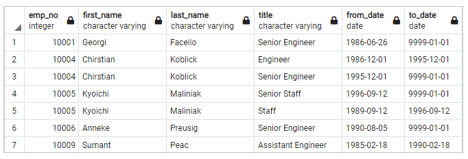
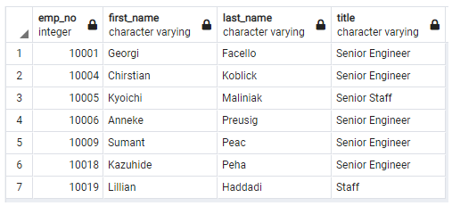
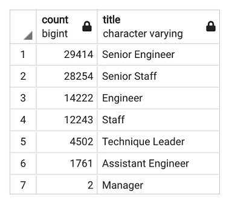
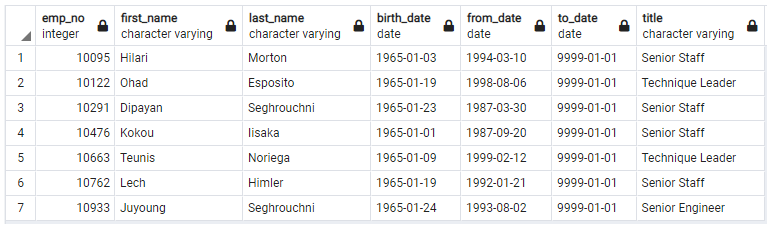
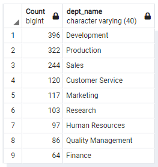

# Pewlett Hackard Analysis
Employee database analysis on retiring employees using [PostgreSQL](https://www.enterprisedb.com/downloads/postgres-postgresql-downloads) and pgAdmin.

## Overview of the project
The purpose of this project was to conduct an analysis for Pewlett Hackard company, with detailed information on the number of future retirees from all departments working at the company, to be able to prepare a plan to hire new staff and also to prepare a mentorship program. The criterion was based on the birth dates ranging from January 1, 1965 and December 31, 1965.
 

## Analysis

**[Tables Relationship Diagram](Data/ERD.png)**
shows the structure of dataset, the relationship between tha data tables, and the Primary and Foreign Keys, that helps the analysis.
 
 

### The Number of Retiring Employees by Title

Take the steps:
  - Create a [Retirement Titles](Data/retirement_titles.csv) table for employees who are born between January 1, 1952 and December 31, 1955. 
    
  - Create a [Unique Titles](Data/unique_titles.csv) table that contains the employee number, first and last name, and most recent title, 
    to remove the duplicate entries from the Retirement_Titles table  
     
  - Create a [Retiring Titles](Data/retiring_titles.csv) table that contains the number of titles filled by employees who are retiring. 
     

 

### The Employees Eligible for the Mentorship Program
List of employees who are eligible for a mentorship program in the [Mentorship Eligibility](Data/mentorship_eligibilty.csv) table that holds the current employees who were born between January 1, 1965 and December 31, 1965.  

 
#### Number of Potential Mentors in Each Department
  

 

## Summary
Ideally, as the silver tsunami approaches, the idea would be to prepare and be on the look for 72,458 employees. This number represents the number of people that are currently working at the company,  and their birth date is between 1952 and 1955 to be eligible to leave work. 
The plan is to offer the mentorship program to the employees whose birth date is 1965, so that they can mentoring new employees. Number of potential mentors is 1549 in total, which is a significant number.

